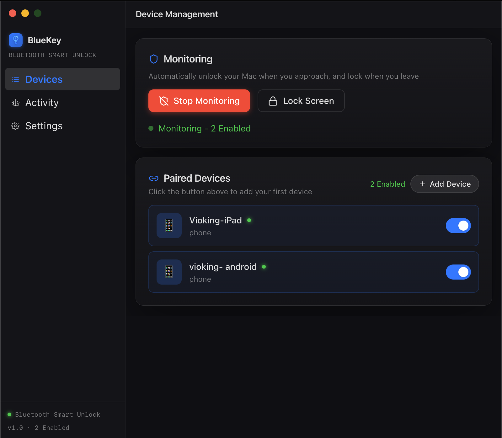
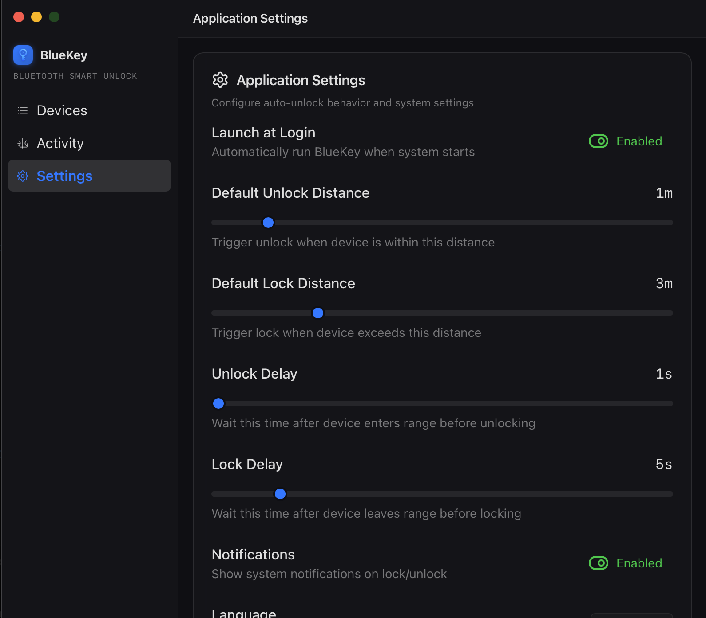

# BlueKey - Smart Bluetooth Unlocking System

<p align="center">
  
</p>

[中文文档](README_zh.md) | English

BlueKey automatically detects your physical distance via Bluetooth devices (RSSI) to seamlessly unlock or lock your computer. An imperceptible security guardian making your digital life more elegant.

## 📸 Screenshots

<p align="center">
  
  
  
  
</p>

## ✨ Key Features

- 🔍 **Real-time BLE Scanning** - Automatically scans for nearby Bluetooth Low Energy (BLE) devices with extremely low latency and minimal power consumption.
- 📱 **Multi-Device Management** - Bind multiple devices (phones, smartwatches, iBeacons, etc.) and enable them simultaneously.
- 📏 **Dynamic Distance Estimation** - Precisely calculates physical distance using real-time RSSI signal conversion and Kalman filtering.
- 🎯 **One-Click Radar Calibration** - Offers graphical distance calibration to build an exclusive signal attenuation model based on the unique transmission power of each device.
- 🔓 **Auto Unlock/Lock** - Automatically unlocks your computer when an authorized device comes into range, and locks it when all devices move away.
- 🎨 **Modern Interface** - Built with TailwindCSS and a Glassmorphism design philosophy featuring elegant micro-animations.
- 🚥 **Smart System Tray Icon** - The status bar icon dynamically responds to the monitoring state (Blue when actively monitoring, Gray when idle).
- 🔐 **Strict Security Mechanism** - Device pairing verification codes and full-lifecycle system security audit logs.

---

## 💡 How It Works & Multi-Device Arbitration

The system uses `btleplug` in the background to capture high-frequency BLE advertisement packets from bonded devices and converts the Signal Strength (RSSI) into relative distance. To guarantee both convenience and security when you use multiple devices, BlueKey applies the following arbitration rules:

* **Auto Unlock (OR Logic)**: If **ANY ONE** enabled device enters your designated "Unlock Zone" and stays for the required duration, the computer is unlocked seamlessly.
* **Auto Lock (AND Logic)**: To prevent accidental locking caused by temporary signal obstruction (e.g., covering your smartwatch), the system strictly requires that **ALL enabled devices** must fully exit the "Lock Zone" and remain out of range before issuing the lock command to the OS.

---

## 📱 Device Compatibility Guide

Due to differing Bluetooth broadcasting strategies across manufacturers, your experience may vary depending on the "key" you choose:

| Device Type | Compatibility Rating | Notes |
| :--- | :---: | :--- |
| **Pure Beacons (iBeacon/Tile, etc.)** | ⭐⭐⭐⭐⭐ | **Highly Recommended**. Specifically designed to be discovered. Broadcasts 24/7 with ultra-low power consumption. The perfect physical key. |
| **Apple Ecosystem** | ⭐⭐⭐⭐⭐ | iPhones, iPads, and Apple Watches deeply rely on BLE. They continuously broadcast stable signals in the background, providing a flawless experience. |
| **Wear OS / Full Smartwatches** | ⭐⭐⭐⭐ | With larger batteries, these typically maintain a high BLE broadcast frequency for ecosystem connectivity. Very responsive. |
| **Garmin / Pro Sports Watches** | ⭐⭐⭐⭐ | Many models support a "Broadcast Heart Rate (BLE)" toggle. When enabled, they serve as excellent unlocking keys. |
| **Android Phones** | ⭐⭐⭐ | Standard Android phones usually do not broadcast BLE packets continuously while the screen is off. They require a third-party BLE Beacon simulator app to be discovered reliably. |
| **Xiaomi Bands / Lite Wearables** | ⭐⭐ | To save battery, these devices **completely stop broadcasting publicly** when connected to a phone app (Silent Mode). BlueKey cannot scan them unless they are disconnected from the phone or put into an unbonded tracking state. |

---

## 🛠️ Technology Stack

- **Frontend Architecture**: React + TypeScript + Vite + TailwindCSS
- **Cross-Platform Host**: Tauri v2
- **Core Logic & OS Control**: Rust (Tokio async runtime)
- **Low-Level Bluetooth Driver**: `btleplug` (Cross-platform BLE manipulation API)

---

## 🚀 Development Guide

### Prerequisites

- Node.js 18+
- Rust 1.70+
- Host machine must have a working Bluetooth adapter

### Local Build & Run

```bash
# 1. Install frontend dependencies
npm install

# 2. Start Tauri dev environment (Auto compiles Rust & HMR for Frontend)
npm run tauri dev

# 3. Build release bundle
npm run tauri build
```

---

## ⚙️ Core Configuration

| Parameter | Default Value | Description |
|------|--------|------|
| **RSSI_1M** | -59 dBm | Reference signal strength at 1 meter (can be overwritten via calibration) |
| **PATH_LOSS_EXPONENT** | 2.0 | Bluetooth signal spatial path loss exponent |
| **default_unlock_range** | 2.0m | Threshold distance to trigger an unlock action |
| **default_lock_range** | 5.0m | Threshold distance to trigger a lock action |
| **unlock_delay / lock_delay** | 2s / 5s | Debounce delay to prevent false triggers caused by sudden signal fluctuations |

---

## 💻 Cross-Platform Implementation Details

The system control module (Lock/Unlock) relies on the following native implementations across platforms:

| Platform | Screen Lock Method | Auto-Start Implementation |
|------|------|------|
| **macOS** | `pmset displaysleepnow` / ScreenSaverEngine | LaunchAgent |
| **Windows** | `rundll32.exe user32.dll,LockWorkStation` | Windows Registry |
| **Linux** | `loginctl` / `gnome-screensaver` / `xflock4` | Desktop Entry |

---

## 📄 License

This project is open-sourced under the [MIT License](./LICENSE).

**Version**: v0.1.0  
**Author**: Vioking
