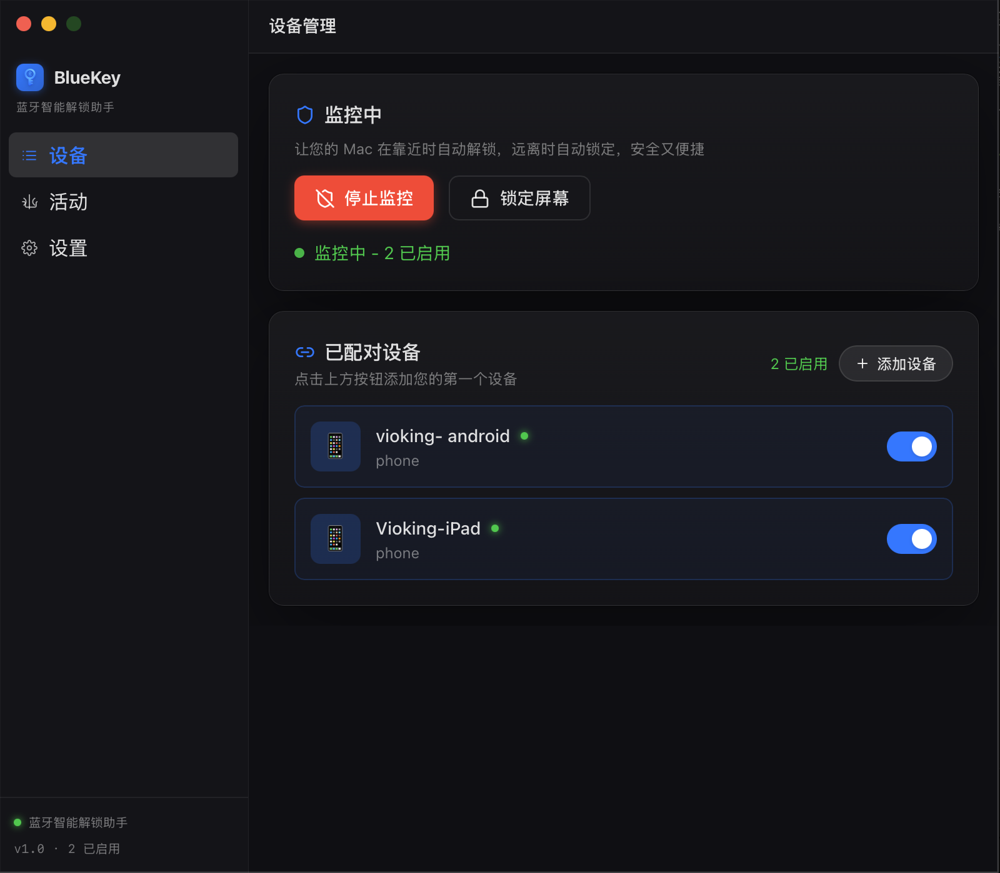
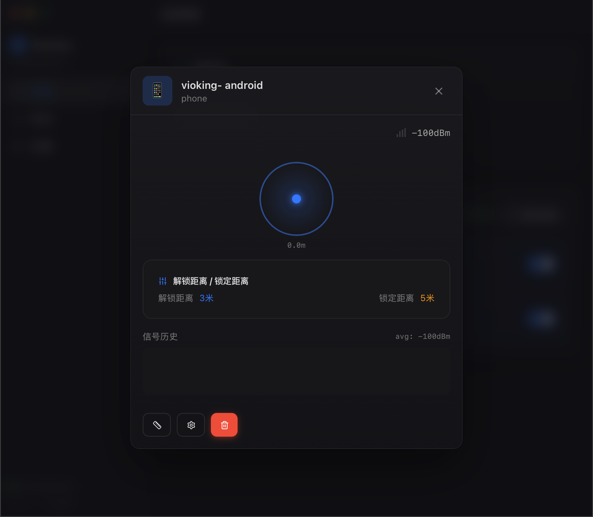
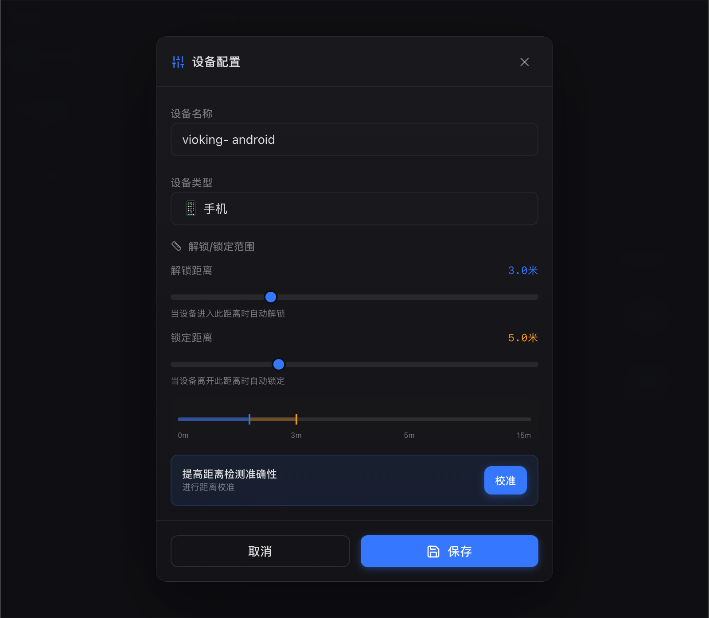
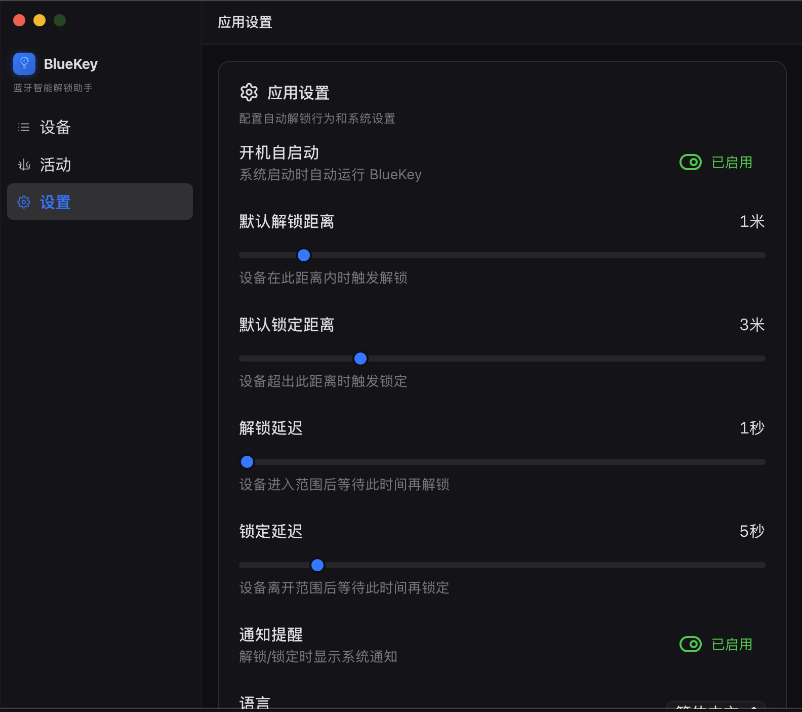

# BlueKey - 蓝牙智能解锁系统

<p align="center">
  
</p>

<p align="center">
  <a href="https://github.com/ViokingTung/bluekey/releases"></a>
  <a href="https://tauri.app/"></a>
  <a href="https://github.com/ViokingTung/bluekey/blob/main/LICENSE"></a>
</p>

基于蓝牙设备物理距离（RSSI），自动感应并在您离开时锁定电脑，靠近时唤醒屏幕。无感知、跨平台的安全守护，让您的数字生活更优雅。

## 📸 界面预览

<p align="center">
  
  
  
  
</p>

## ✨ 核心特性

- 🔍 **BLE 实时扫描** - 自动扫描附近的低功耗蓝牙 (BLE) 设备，低延迟且极度省电
- 📱 **多设备平权管理** - 支持绑定多台设备（手机、手表、iBeacon等）并同时启用
- 📏 **动态距离估算** - 借助卡尔曼滤波与实时信号折算公式，精确输出物理距离
- 🎯 **一键雷达校准** - 提供图形化距离校准功能，针对不同设备的信号发射功率计算专属衰减模型
- 🔓 **自动锁屏与靠近唤醒** - 全部授权设备远离即自动锁屏，任意设备靠近进入范围即自动唤醒屏幕并准备解锁（遵循系统底层安全规范，不暴力绕过密码校验）
- 🎨 **现代化交互** - 采用 TailwindCSS + 玻璃拟物态 (Glassmorphism) + 优雅的微动效设计
- 🚥 **智能状态栏图标** - 状态栏图标智能跟随监控状态（监控中蓝色，未监控灰色）
- 🔐 **严密安全机制** - 设备配对验证码及全生命周期的系统级安全审计日志

---

## 💡 工作原理与多设备裁决机制

系统通过 `btleplug` 在后台高频捕获绑定设备的蓝牙低功耗广播包，并从信号强度（RSSI）换算出相对距离。为了保证您在拥有多个设备时的安全与便利，系统采用了以下判定策略：

* **靠近唤醒 (OR 逻辑)**：只要有**任意一台**启用的设备进入您的“解锁安全圈”并维持判定时间，电脑立即无感唤醒亮屏，等待您的指纹/面容/密码输入。
* **自动锁定 (AND 逻辑)**：为了防止手环信号短暂遮挡导致的误锁屏，系统严格判定：**必须等到所有启用的设备**全部撤出“锁定判定圈”外并维持判定时间，才会触发操作系统的锁屏指令。

---

## 📱 设备兼容性指南

由于各厂家的蓝牙广播策略不同，作为“钥匙”使用时体验会有所差异：

| 设备类型 | 兼容性评级 | 说明 |
| :--- | :---: | :--- |
| **纯粹信标 (iBeacon/Tile等)** | ⭐⭐⭐⭐⭐ | **最佳推荐**。专为被发现而设计，24小时高频广播且耗电极低，是完美的物理钥匙。 |
| **Apple 苹果设备生态** | ⭐⭐⭐⭐⭐ | iPhone/iPad/Apple Watch 底层深度依赖 BLE，会持续稳定在后台广播，体验丝滑完美。 |
| **Wear OS / 全功能智能手表** | ⭐⭐⭐⭐ | 电池较大，通常为了互联功能会保持较高的蓝牙广播频率，响应迅速。 |
| **Garmin 等专业运动手表** | ⭐⭐⭐⭐ | 许多型号支持开启“广播心率(BLE)”，开启后可作为极佳的钥匙使用。 |
| **Android 手机** | ⭐⭐⭐ | 普通安卓手机息屏时通常不会对外高频广播 BLE，需要配合第三方 BLE Beacon 模拟软件才能稳定被扫描。 |
| **小米手环 / 轻量化穿戴** | ⭐⭐ | 为了省电，这类设备**连接着手机时会完全停止对外广播**（静默状态）。除非断开与手机的连接或使其处于独立寻找状态，否则扫描器无法发现它们。 |

---

## 🛠️ 技术栈

- **前端架构**: React + TypeScript + Vite + TailwindCSS
- **跨平台宿主**: Tauri v2
- **核心逻辑与系统控制**: Rust (Tokio 异步运行时)
- **底层蓝牙驱动**: `btleplug` (跨平台 BLE 操作 API)

---

## 🚀 开发指南

### 环境要求

- Node.js 18+
- Rust 1.70+
- 宿主机系统必须具备蓝牙适配器
- **Linux 用户注意**: 请确保已安装 `bluez` 并且您的系统用户被加入了 `bluetooth` 用户组，以免扫描时出现权限报错。

### 本地编译与运行

```bash
# 1. 安装前端依赖
npm install

# 2. 启动 Tauri 开发环境 (自动编译 Rust 与热更新前端)
npm run tauri dev

# 3. 构建发布应用包
npm run tauri build
```

---

## ⚙️ 核心配置说明

| 核心参数 | 默认值 | 说明 |
|------|--------|------|
| **RSSI_1M** | -59 dBm | 设备在 1 米处的参考信号强度（可通过校准重写） |
| **PATH_LOSS_EXPONENT** | 2.0 | 蓝牙信号路径空间损耗指数 |
| **default_unlock_range** | 2.0m | 判定为可以执行解锁的安全距离 |
| **default_lock_range** | 5.0m | 判定为必须锁定电脑的远离距离 |
| **unlock_delay / lock_delay** | 2s / 5s | 动作确认防抖延迟，防止信号剧烈波动带来的误触 |

---

## 💻 跨平台适配详情

目前系统控制模块 (Lock/Unlock) 在多平台的底层调用实现为：

| 平台 | 锁屏底层实现 | 自启动实现 | 蓝牙底层调用 |
|------|------|------|------|
| **macOS** | `pmset displaysleepnow` / ScreenSaverEngine | LaunchAgent | CoreBluetooth |
| **Windows** | `rundll32.exe user32.dll,LockWorkStation` | 注册表 | Windows.Devices.Bluetooth |
| **Linux** | `loginctl` / `gnome-screensaver` / `xflock4` | Desktop Entry | BlueZ |

---

## 📄 许可证

本项目基于 [MIT License](./LICENSE) 开源。

**版本**: v0.1.4  
**作者**: Vioking
